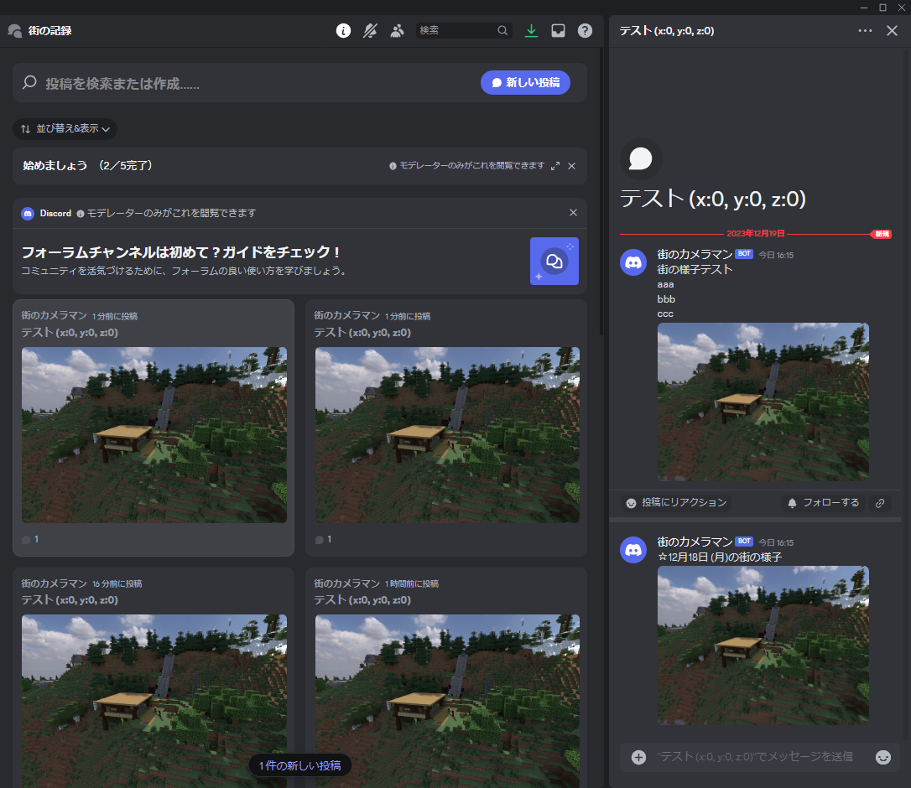

# ChunkyDaily

## 説明

毎日生活鯖の様子をDiscordのフォーラムチャンネルに投稿します

## 準備

1. スクリプトに実行権限を付与します
  `chmod +x scripts/*.sh`
2. config.default.shをconfig.shにコピーします
  config.shの`DISCORD_WEBHOOK_URL`にDiscordのフォーラムチャンネルのWebhook URLを入力します
3. sync-world.default.shをsync-world.shにコピーします
  サーバーに合わせて、ワールドデータを取得するコマンドに書き換えます
4. cronに`scripts/main.sh`を実行するように設定します
  例: `0 0 * * * /path/to/scripts/main.sh`
5. Chunkyで生成したシーンファイルを後述の方法で追加します

## シーンファイルの追加

### 作業PCでの操作
1. 作業PCでChunkyでシーンを生成します  
  このとき、使ったアセット(画像など)はassetsフォルダに入れてからChunkyで読み込みます
2. シーンに名前をつけて、Chunkyの左上にある「Save the current scene」をクリックし、保存します
3. %APPDATA%/.chunky/scenes/に保存されたシーンフォルダを、フォルダごとサーバー上の`import`フォルダにコピーします

### サーバーでの操作
4. `scripts/chunky-import-scene.sh`を実行します
5. `scenes`フォルダにシーンファイルが生成されていることを確認します  
  生成されたJson内に作業PCのパスが含まれている場合は修正してください
6. `scenes/シーン名/summary.txt`を作成し、1行目にタイトル、3行目以降に説明文を書きます
7. `scripts/check-all-scene.sh`を実行し、シーンファイルが正しく配置されていることを確認します
8. `scripts/chunky-load-scene.sh`を実行します
